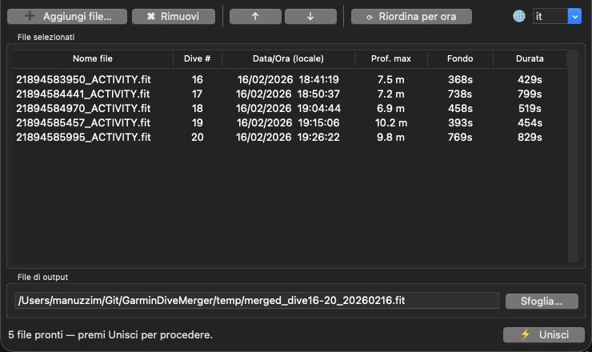

# GarminDiveMerger

**GarminDiveMerger** è un'utility desktop (Python + tkinter) che unisce più file `.fit` di immersioni registrati separatamente dal **Garmin Descent MK3** in un unico file importabile su **Garmin Connect** come sessione singola.



---

## ⚠️ Nota importante — Prima del caricamento

> **Prima di caricare il file `.fit` unito su Garmin Connect, elimina le immersioni parziali/separate** già eventualmente sincronizzate dall'orologio.
> Se le immersioni originali sono già presenti su Garmin Connect, importare il file merged provocherebbe duplicati.
> Elimina prima ogni immersione singola dal portale Garmin Connect, poi carica il file unito.

---

## Funzionalità

- Unisce **N file `.fit`** di immersioni in un'unica sessione a sessione singola
- Inserisce **record di superficie** (gap fill) tra un'immersione e l'altra
- Deduplica automaticamente le miscele gas (`dive_gas`) identiche
- Aggrega correttamente i metadati della sessione:
  - `max_depth` → massimo globale tra tutte le immersioni
  - `bottom_time` / `total_elapsed_time` → somma totale
  - `start_n2` / `start_cns` → valori della prima immersione
  - `end_n2` / `end_cns` → valori dell'ultima immersione
  - `total_calories` → somma di tutte le immersioni
- Interfaccia **multilingua**: 🇮🇹 Italiano · 🇬🇧 English · 🇩🇪 Deutsch · 🇫🇷 Français · 🇪🇸 Español

---

## Requisiti

- Python 3.10+
- [`fitdecode`](https://github.com/polyvertex/fitdecode) ≥ 0.10.0
- [`fit-tool`](https://github.com/mtucker6784/fit-tool) ≥ 0.9.0
- `tkinter` (incluso in Python; su macOS Homebrew installare `python-tk`)

---

## Installazione

```bash
git clone https://github.com/manuzzi/GarminDiveMerger.git
cd GarminDiveMerger

python3 -m venv .venv
source .venv/bin/activate          # Windows: .venv\Scripts\activate
pip install -r requirements.txt
```

Su **macOS con Homebrew**:
```bash
brew install python-tk@3.x   # sostituire 3.x con la versione Python in uso
```

---

## Utilizzo

```bash
source .venv/bin/activate
python3 merge_fit.py
```

1. Clicca **Aggiungi file…** e seleziona i file `.fit` da unire
2. I file vengono ordinati automaticamente per data/ora di inizio
3. Usa ↑ / ↓ per riordinare manualmente se necessario
4. Verifica il percorso del **file di output** (generato automaticamente)
5. Clicca **⚡ Unisci**
6. Carica il file `.fit` risultante su **Garmin Connect** → _Importa dati_

---

## Dispositivi supportati

Testato con **Garmin Descent MK3** (sport `diving` / sub-sport `multi_gas_diving`).
Potenzialmente compatibile con altri computer subacquei Garmin che producono file `.fit` con messaggi `dive_summary`.

---

## Licenza

Vedere [LICENSE](LICENSE).
